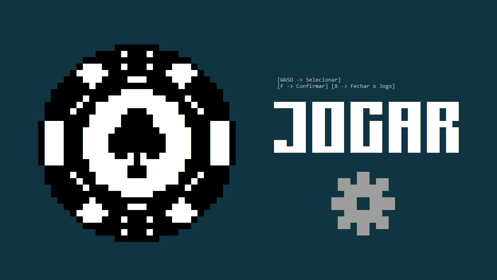
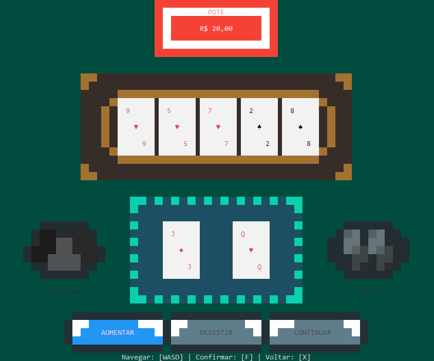

# Poker – Filhos do Limoeiro

> Poker Texas Hold’em no terminal — projeto semestral da disciplina **Algoritmos e Estruturas de Dados (AEDs)** da Universidade SENAI Cimatec.

## Visão geral
Este projeto demonstra como construir, em **C puro**, um jogo completo de poker que roda inteiramente no console, sem bibliotecas gráficas externas.  
Foi desenvolvido como trabalho final da disciplina, solidificando conceitos de **listas encadeadas**, **pilhas**, **filas** e algoritmos de ordenação.

  

## Principais funcionalidades
- **Renderização usando [ANSI ESCAPE SEQUENCE](https://gist.github.com/fnky/458719343aabd01cfb17a3a4f7296797)** para cartas, mesa e animações.  
- **Engine de estados** (menu, apostas, distribuição, showdown) sobre estruturas dinâmicas.  
- **Persistência** de perfil e partidas em `saves/`.  
- **Trilha sonora e efeitos** via [miniaudio.h](https://github.com/mackron/miniaudio)  
- **Versão portátil** distribuída em [/diretorio_portatil](https://github.com/MatheusSena02/Poker_Filhos_do_Limoeiro/tree/main/diretorio_portatil).  

## Controles
| Ação                           | Tecla       | Observação                                  |
|-------------------------------|------------|---------------------------------------------|
| Navegar menus / ajustar aposta| **W A S D**| Cima, esquerda, baixo, direita              |
| Confirmar / prosseguir        | **F**      | Apostar, virar cartas, etc.                 |
| Voltar / cancelar             | **X**      | Retorna ao menu ou etapa anterior           |

### Como jogar
1. Baixe diretorio_portatil.zip
2. Execute `JogoPoker.exe`, siga as instruções e use as teclas acima.  
3. (Caso a janela tenha se redimensionado sozinha, não fazer esse passo)
Coloque a janela em tela cheia e inicie o jogo (F)
### Compilação
Requisitos: **MinGW-w64**
> Para Linux/macOS será necessário portar o áudio e remover dependências de `windows.h`.

## Avatares
| | | | | |
|---|---|---|---|---|
|  **Gato** |  **Esquilo** |  **Rato** |  **Sapo** |  **Urso** |

## Créditos
| Papel                    | Integrantes                                                               |
|--------------------------|---------------------------------------------------------------------------|
| **Autores**              | Arthur Farias · Lucas Lima · Samara Souza · João Lessa · Matheus Sena     |
| **Professor-orientador** | Márcio Soussa                                                             |